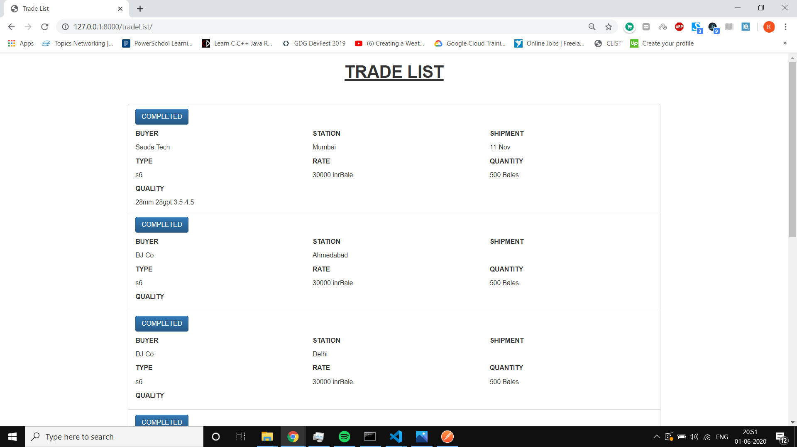

# SaudaTech_Task
Sauda Tech Intern Task implemented at http://127.0.0.1:8000/tradeList/

## TOOLS & LIBRARIES
* Python - 3.8.2
* Django - 3.0.5
* requests

## GETTING STARTED
* Clone this repository.
* Set up a python virtual environment and activate it in your terminal. (Refer - <a>https://docs.python.org/3/tutorial/venv.html</a>)
* Open it in terminal and run the following commands - 
  ~~~ 
     pip install -r requirements.txt
  ~~~
  ~~~ 
     python manage.py migrate
  ~~~
  ~~~ 
     python manage.py runserver
  ~~~
* Open http://127.0.0.1:8000/tradeList/ in your browser

## SCREENSHOT

